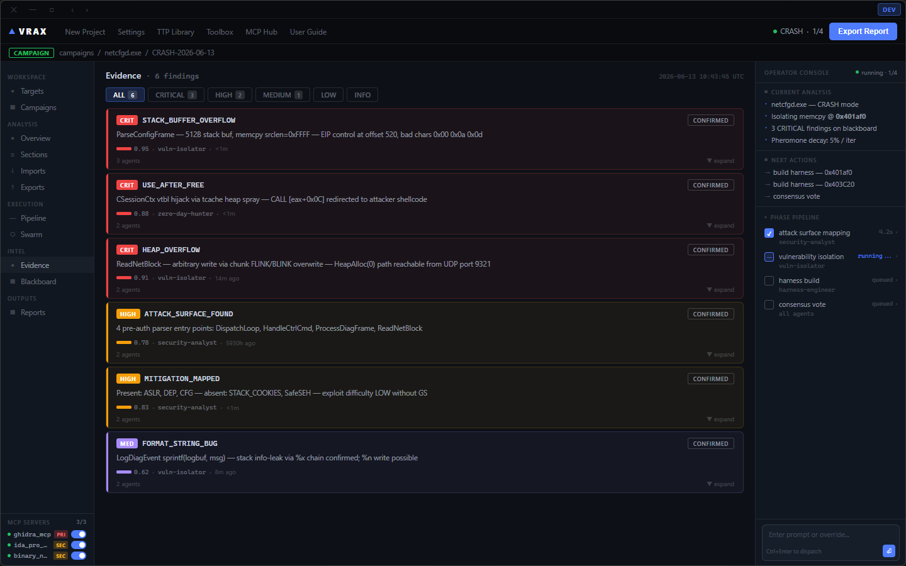
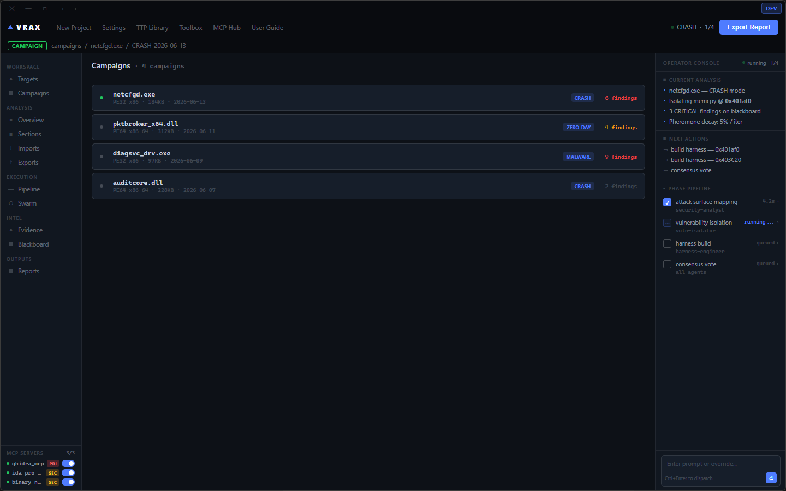
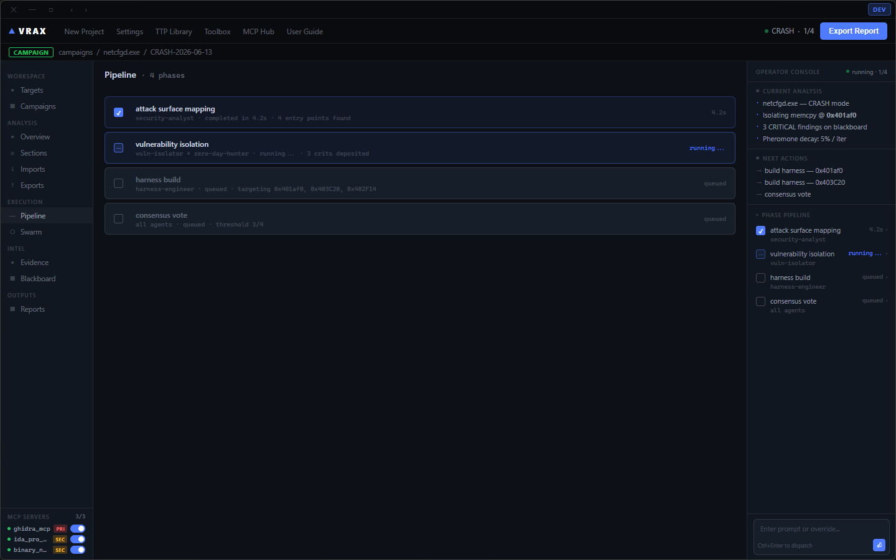
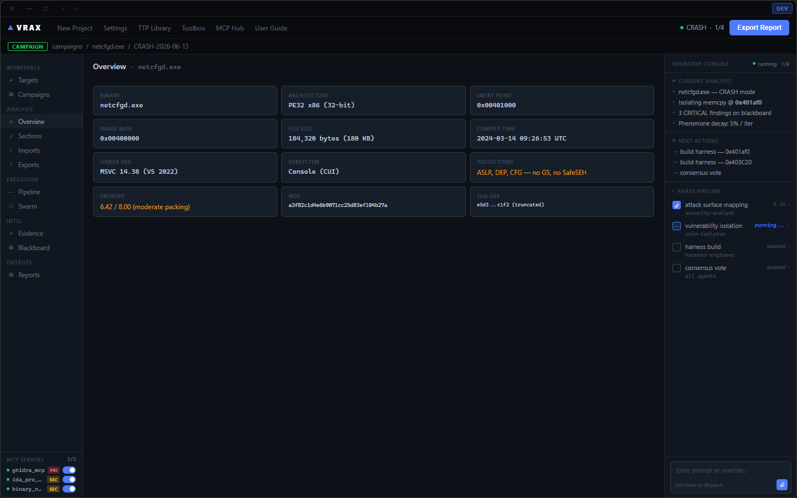
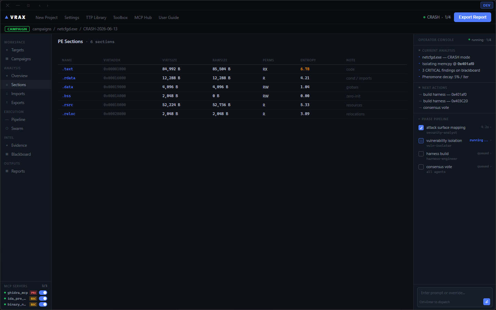
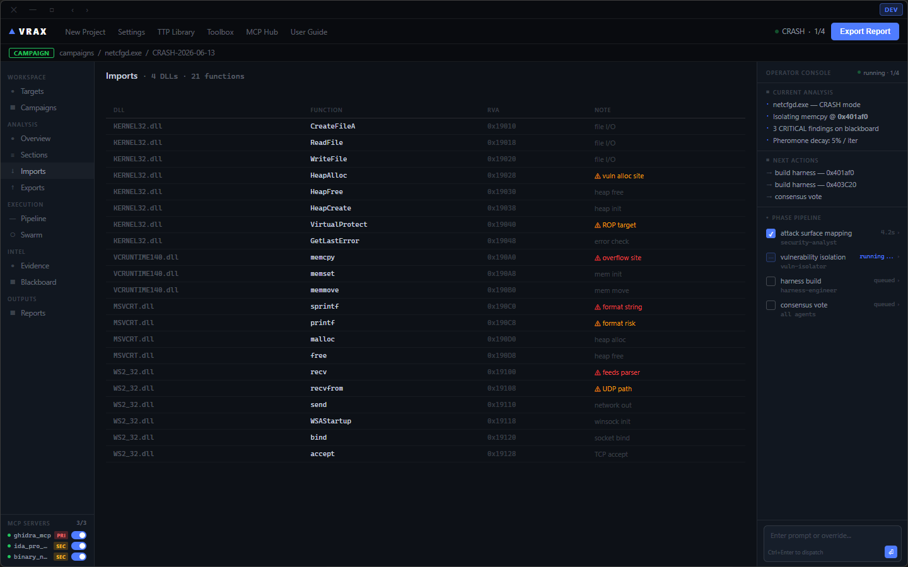
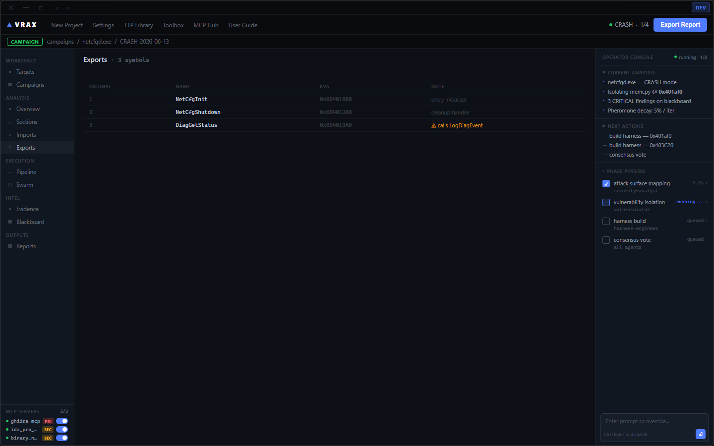
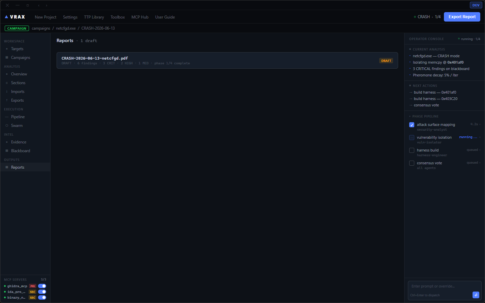

<p align="center">
  
</p>

<h1 align="center">VRAX</h1>
<p align="center"><strong>Autonomous Reverse Engineering AI Swarm</strong></p>
<p align="center">Multi-agent binary analysis framework — council orchestrator, blackboard stigmergy, pheromone scoring</p>

<p align="center">
  
  
  
  
  
</p>

---

## Overview

VRAX is a fully autonomous reverse engineering platform built on a **multi-agent AI swarm**. The council orchestrator coordinates specialized agents that deposit findings onto a shared blackboard using pheromone-weighted stigmergy — the same coordination mechanism used by ant colonies.

Binary analysis runs entirely on autopilot: load a target, launch the pipeline, and the swarm produces prioritized vulnerability findings with full evidence trails.

---

## Screenshots

| Blackboard (live findings) | Evidence Chain |
|---|---|
|  |  |

| Campaign Manager | Swarm Status |
|---|---|
|  |  |

| Binary Overview | PE Sections |
|---|---|
|  |  |

| Import Table | Export Table |
|---|---|
|  |  |

| Analysis Pipeline | Reports |
|---|---|
|  |  |

---

## Architecture

```
┌─────────────────────────────────────────────────────────────┐
│                    VRAX Council Orchestrator                 │
│              (coordinates all specialized agents)            │
└──────────────────────────┬──────────────────────────────────┘
                           │
          ┌────────────────┼────────────────┐
          ▼                ▼                ▼
  ┌──────────────┐ ┌──────────────┐ ┌──────────────┐
  │  security-   │ │    vuln-     │ │  zero-day-   │
  │   analyst    │ │   isolator   │ │    hunter    │
  └──────┬───────┘ └──────┬───────┘ └──────┬───────┘
         │                │                │
         ▼                ▼                ▼
┌────────────────────────────────────────────────────┐
│                  BLACKBOARD (stigmergy)             │
│  Findings deposited with pheromone weights φ 0–1   │
│  Decay 5%/iteration · Council reads + prioritizes  │
└────────────────────────────────────────────────────┘
         │
         ▼
┌─────────────────────────────┐
│   harness-engineer agent    │  ← compiles PoC harness
│   (auto-triage & exploit)   │
└─────────────────────────────┘
```

---

## Agent Roles

| Agent | Phase | Role |
|---|---|---|
| `council-orchestrator` | 0 | Master coordinator — dispatches agents, reads blackboard, sets priorities |
| `knowledge-base` | 0.5 | Research brain — CVE/PoC/KEV lookup before any analysis starts |
| `security-analyst` | 1 | Attack surface mapping — pre-auth entry points, parser lanes |
| `vuln-isolator` | 2 | Vulnerability classification — BOF, UAF, format string |
| `zero-day-hunter` | 3 | Deep heap/vtable analysis — 0day primitive hunting |
| `harness-engineer` | 4 | PoC harness compilation + crash reproduction |

---

## Blackboard Stigmergy

Agents communicate exclusively through the blackboard — no direct agent-to-agent calls. Each finding carries a **pheromone weight φ (0.0–1.0)**:

- `φ ≥ 0.9` — Council escalates immediately, all agents re-orient
- `φ 0.7–0.89` — HIGH priority, scheduled next iteration  
- `φ 0.5–0.69` — MEDIUM, queued
- `φ < 0.5` — LOW, background

Pheromone decays **5% per iteration**. Stale findings auto-expire. Fresh evidence reinforces weight.

---

## MCP Integration

VRAX connects to binary analysis tools via Model Context Protocol:

| Server | Priority | Tools |
|---|---|---|
| `ghidra_mcp` | PRIMARY | Decompilation, cross-refs, data types |
| `ida_pro_mcp` | SECONDARY | `list_funcs`, `imports`, `decompile`, `xrefs_to`, `stack_frame` |
| `binary_ninja_mcp` | SECONDARY | `list_binaries`, `get_il`, `decompile_function` |

---

## Repo Structure

```
vrax/
├── packages/
│   ├── core/          TypeScript core library (LSP, streaming, tools)
│   ├── server/        HTTP + WebSocket server
│   ├── desktop/       Desktop shell
│   ├── tui/           Terminal UI (Ink/React)
│   ├── app/           Web app (SvelteKit)
│   ├── console/       Cloud console
│   ├── cli/           CLI entry point
│   ├── llm/           LLM provider abstraction (Claude, GPT, Gemini, local)
│   └── ui/            Shared component library
├── electron/          Electron GUI — council dashboard
│   ├── main.js        Main process
│   ├── preload.js     Context bridge
│   └── renderer/      Dashboard HTML/CSS
├── agents/            Agent definition files (*.md) + helper scripts
│   ├── council-orchestrator.md
│   ├── security-analyst.md
│   ├── vuln-isolator.md
│   ├── zero-day-hunter.md
│   ├── knowledge-base.md
│   └── v2/            V2 agent system with preambles
├── infra/             SST v3 (TypeScript) — cloud infra
├── sdks/              SDK packages
├── docs/
│   └── screenshots/   UI screenshots (all pages)
├── campaigns/         Campaign state files
└── config/            Shared config
```

---

## Design System

```css
--bg0:     #090B0F   /* deep void */
--bg1:     #0D1117   /* base background */
--bg2:     #111720   /* card surface */
--bg3:     #161E2A   /* elevated surface */
--accent:  #4F7CFF   /* primary blue */
--purple:  #A78BFA   /* MED severity */
--red:     #FF4444   /* CRIT severity */
--amber:   #F59E0B   /* HIGH severity */
--green:   #22C55E   /* confirmed/clean */
--muted:   #6B7280   /* secondary text */
```

---

## Getting Started

**Requirements:** Bun 1.3+, Node 20+, IDA Pro or Binary Ninja (for MCP)

```bash
# Install dependencies
bun install

# Start the desktop app
bun run dev:desktop

# Start the Electron dashboard
cd electron && npm install && npm start

# Start the web interface
bun run dev:web

# Run the terminal UI
bun run dev
```

---

## License

MIT — See [LICENSE](LICENSE)
