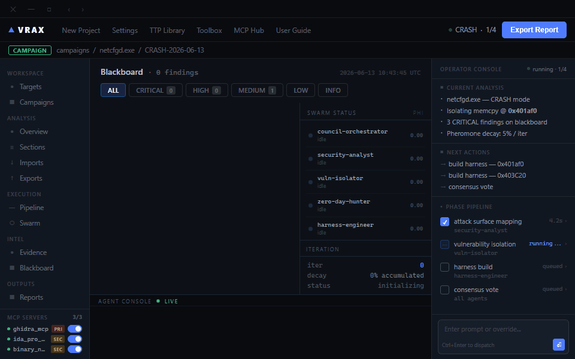

<p align="center">
  
</p>

<p align="center">
  
  
  
  
</p>

<p align="center">
  
</p>

---

## What is VRAX?

VRAX is a multi-agent AI swarm that autonomously reverse-engineers binary targets — finding zero-days, isolating vulnerabilities, building crash harnesses, and generating security reports — without human in the loop.

A **council orchestrator** directs a team of specialist agents over a shared blackboard, using pheromone-based reinforcement to escalate high-confidence findings and decay stale leads.

---

## Architecture

```
council-orchestrator   ← master agent — sequences phases, manages blackboard
├── security-analyst   ← phase 1: attack surface mapping, CVSS scoring
├── vuln-isolator      ← phase 2: vulnerability classification, bad char mapping
├── zero-day-hunter    ← phase 2.5: zero-day hunt, exploit chain construction
├── harness-engineer   ← phase 3: PoC harness build & crash verification
└── qa-tester          ← phase 4: verification & consensus vote
```

Agents communicate via a shared `council_state.json` blackboard. The UI watches this file in real time and updates live as findings are deposited.

---

## Pipeline

| Phase | Name | Agent |
|-------|------|-------|
| 1 | Attack Surface Mapping | security-analyst |
| 2 | Vulnerability Isolation | vuln-isolator |
| 2.5 | Zero-Day Hunt | zero-day-hunter |
| 3 | Harness Build | harness-engineer |
| 4 | Verification | qa-tester |
| 5 | Report | council-orchestrator |

---

## UI

The Electron app (`electron/`) provides a real-time dashboard:

- **Blackboard** — live finding cards with severity, phi score, and agent attribution
- **Swarm** — per-agent status, pheromone levels, and task descriptions
- **Pipeline** — phase progress with DONE / RUNNING / QUEUED states
- **Operator Console** — current analysis summary and phase pipeline
- **Campaigns** — multi-target campaign management

All content is driven from `council_state.json` — zero hardcoded data.

---

## Stack

- **Agents** — Claude Opus 4 (orchestrator) + Claude Sonnet 4.6 (workers)
- **MCP Tools** — IDA Pro MCP, Ghidra MCP, Binary Ninja MCP
- **UI** — Electron + vanilla JS, no framework
- **State** — `council_state.json` watched with `fs.watch()` for live updates

---

## Getting Started

```bash
# Install dependencies
cd electron
npm install

# Launch the UI
npm start
```

Point the council orchestrator at a binary target, run it, and watch findings populate live.

---

## Author

**ChathurangaBW** — [github.com/ChathurangaBW](https://github.com/ChathurangaBW)
